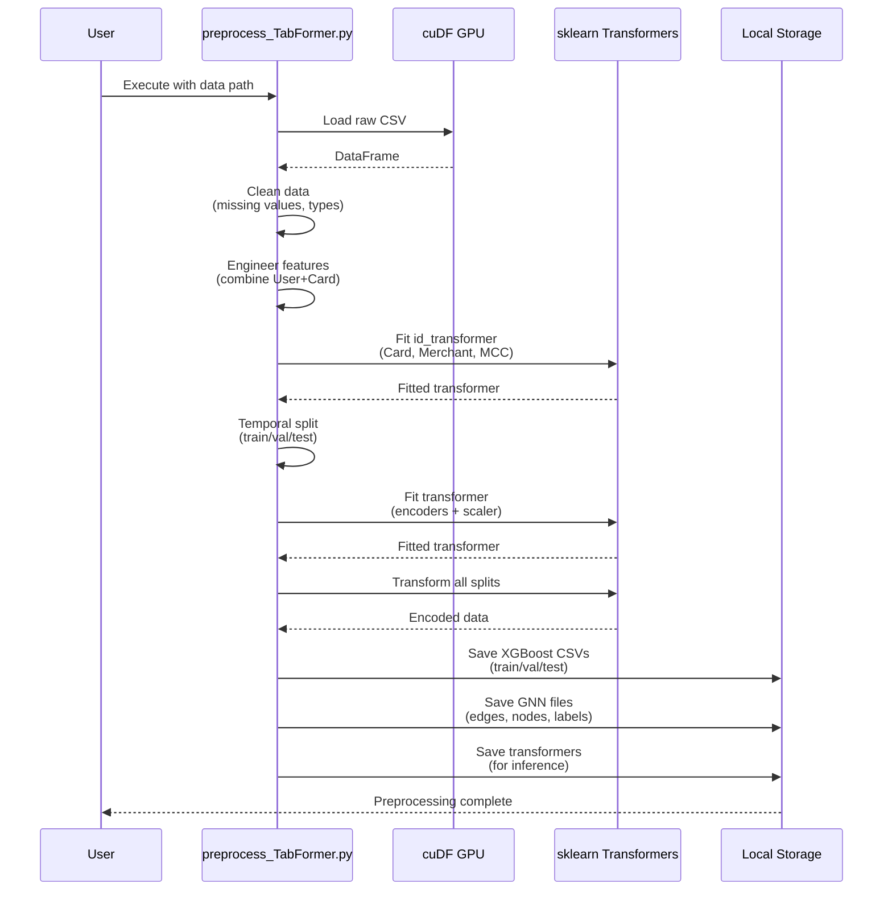
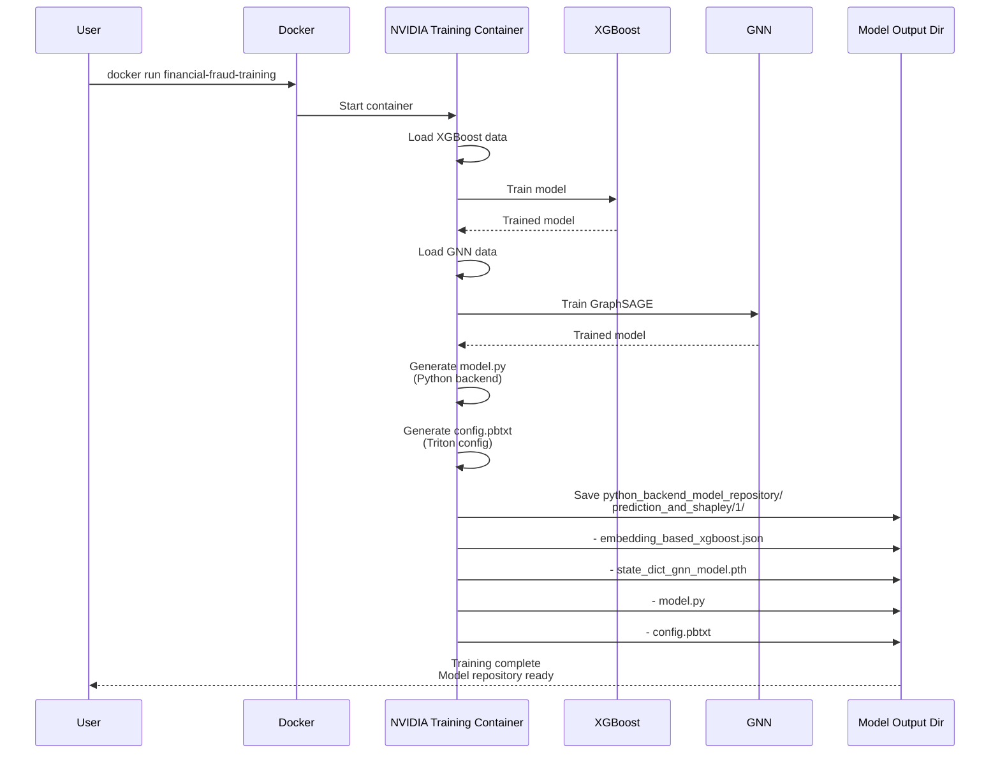
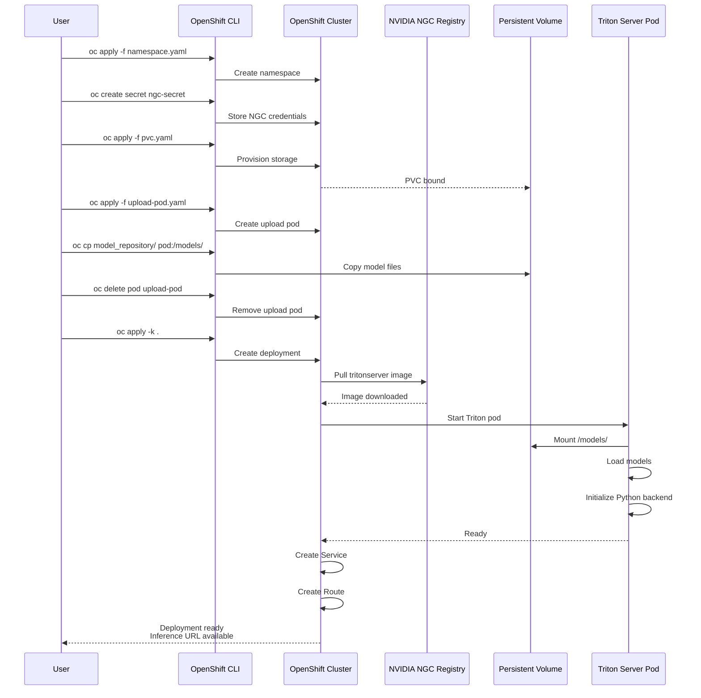
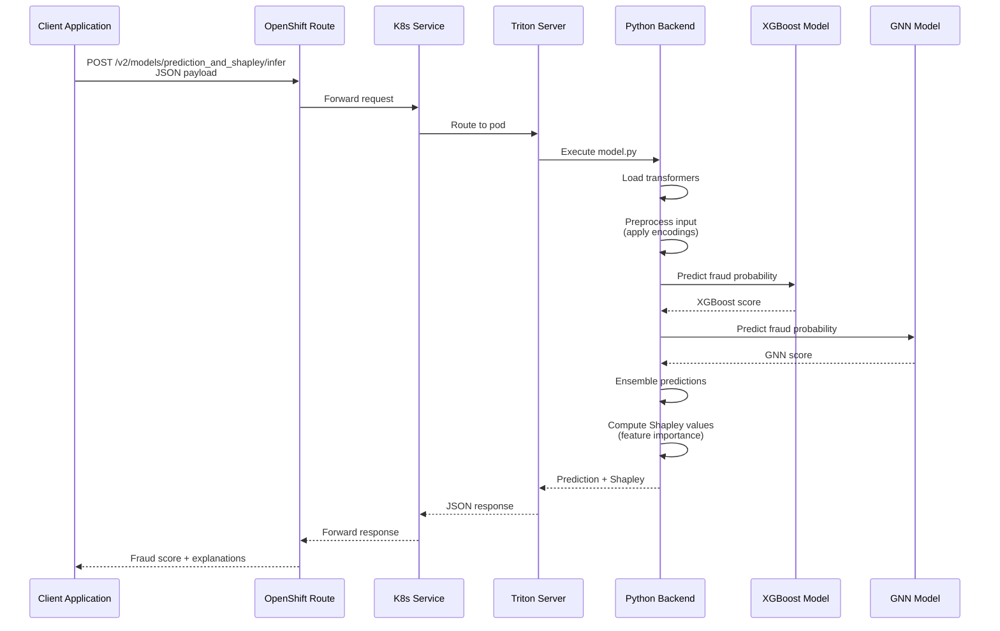
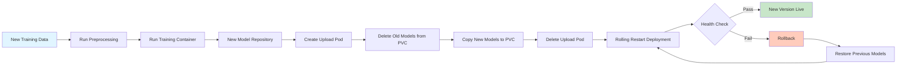
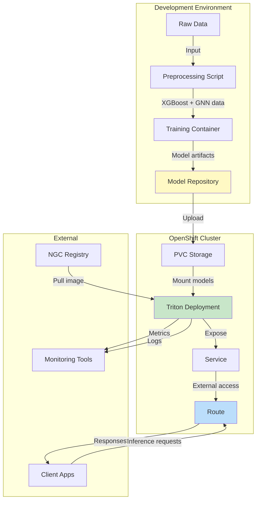
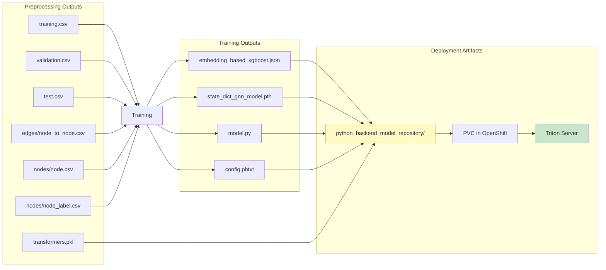

# End-to-End Fraud Detection Workflow

## Complete System Workflow

```mermaid
flowchart TB
    subgraph "Phase 1: Data Preprocessing"
        A1[Raw TabFormer CSV<br/>24M transactions<br/>15 columns]
        A2[Data Cleaning<br/>- Handle missing values<br/>- Type conversions<br/>- Feature engineering]
        A3[Feature Encoding<br/>- Binary encoding high cardinality<br/>- OneHot encoding low cardinality<br/>- RobustScaler for Amount]
        A4[Temporal Split<br/>Train: < 2018<br/>Val: 2018<br/>Test: > 2018]
        A5{Output Format}
        A6[XGBoost Format<br/>training.csv<br/>validation.csv<br/>test.csv]
        A7[GNN Format<br/>edges/node_to_node.csv<br/>nodes/node.csv<br/>nodes/node_label.csv]
        A8[Save Transformers<br/>id_transformer<br/>transformer]
    end
    
    subgraph "Phase 2: Model Training"
        B1[NVIDIA Training Container<br/>financial-fraud-training]
        B2[Train XGBoost Model<br/>Tabular data]
        B3[Train GNN Model<br/>Graph data]
        B4[Generate Model Repository<br/>python_backend_model_repository/]
        B5[Model Artifacts<br/>- embedding_based_xgboost.json<br/>- state_dict_gnn_model.pth<br/>- model.py Python backend<br/>- config.pbtxt Triton config]
    end
    
    subgraph "Phase 3: OpenShift Deployment Setup"
        C1[Prerequisites<br/>- NGC API Key<br/>- OpenShift cluster with GPU<br/>- kubectl/oc CLI]
        C2[Create Namespace<br/>fraud-detection]
        C3[Create NGC Secret<br/>docker-registry]
        C4[Create PVC<br/>Model storage]
        C5[Upload Models<br/>Temporary upload pod]
        C6[Copy Model Repository<br/>to PVC /models/]
    end
    
    subgraph "Phase 4: Triton Deployment"
        D1[Deploy Triton Server<br/>nvcr.io/nvidia/tritonserver]
        D2[Mount PVC<br/>/models/python_backend_model_repository]
        D3[Configure Resources<br/>GPU requests/limits]
        D4[Create Service<br/>Port 8000 HTTP<br/>Port 8001 gRPC]
        D5[Create Route<br/>External HTTPS access]
        D6[Health Check<br/>/v2/health/ready]
    end
    
    subgraph "Phase 5: Inference Operations"
        E1[Client Application]
        E2[Inference Request<br/>POST /v2/models/prediction_and_shapley/infer]
        E3[Triton Python Backend<br/>- Load transformers<br/>- Preprocess input<br/>- Run XGBoost + GNN<br/>- Compute Shapley values]
        E4[Inference Response<br/>- Fraud probability<br/>- Shapley explanations]
        E5[Monitoring<br/>- Metrics /metrics<br/>- Logs<br/>- GPU usage]
    end
    
    subgraph "Phase 6: Model Updates"
        F1[Retrain Models<br/>New data]
        F2[Upload New Models<br/>Upload pod]
        F3[Replace Model Files<br/>in PVC]
        F4[Rolling Restart<br/>Zero downtime]
        F5[Validate New Version<br/>Health checks]
    end
    
    A1 --> A2 --> A3 --> A4 --> A5
    A5 --> A6
    A5 --> A7
    A3 --> A8
    
    A6 --> B1
    A7 --> B1
    B1 --> B2 & B3
    B2 & B3 --> B4 --> B5
    
    B5 --> C1
    C1 --> C2 --> C3 --> C4 --> C5
    C5 --> C6
    
    C6 --> D1
    D1 --> D2 --> D3 --> D4 --> D5 --> D6
    
    D6 --> E1
    E1 --> E2 --> E3 --> E4
    D6 --> E5
    
    E4 -.->|Retrain trigger| F1
    F1 --> F2 --> F3 --> F4 --> F5
    F5 -.->|Updated| E1
    
    style A1 fill:#e1f5ff
    style B5 fill:#fff9c4
    style D6 fill:#c8e6c9
    style E4 fill:#c8e6c9
    style F5 fill:#ffccbc
```



## Detailed Phase Breakdown

### Phase 1: Data Preprocessing (Local Execution)



### Phase 2: Model Training (Docker Container)



### Phase 3 & 4: OpenShift Deployment



### Phase 5: Inference Flow



### Phase 6: Model Update Flow



## Timeline View

```mermaid
gantt
    title Fraud Detection System Deployment Timeline
    dateFormat HH:mm
    axisFormat %H:%M
    
    section Data Prep
    Load & Clean Data           :a1, 00:00, 10m
    Feature Engineering         :a2, after a1, 15m
    Encode & Split             :a3, after a2, 20m
    Save Outputs               :a4, after a3, 5m
    
    section Training
    Setup Container            :b1, after a4, 5m
    Train XGBoost             :b2, after b1, 30m
    Train GNN                 :b3, after b2, 45m
    Generate Artifacts        :b4, after b3, 5m
    
    section Deployment
    Setup OpenShift           :c1, after b4, 5m
    Create Resources          :c2, after c1, 2m
    Upload Models             :c3, after c2, 5m
    Deploy Triton             :c4, after c3, 3m
    Health Check              :c5, after c4, 1m
    
    section Operations
    First Inference           :d1, after c5, 1m
    Monitoring Setup          :d2, after c5, 5m
```



## Component Interaction Map



## Key Artifacts and Their Flow



## Quick Reference: Commands by Phase

### Phase 1: Preprocessing
```bash
python src/preprocess_TabFormer.py --data-path data/TabFormer/raw/
```

### Phase 2: Training
```bash
docker run --gpus all \
  -v $(pwd)/data:/data \
  -v $(pwd)/model_output_dir:/output \
  nvcr.io/nvidia/cugraph/financial-fraud-training:latest
```

### Phase 3 & 4: Deployment
```bash
# Setup
export NGC_API_KEY="your-key"
oc login --server=https://cluster:6443

# Deploy
oc apply -f k8s/inference-only/namespace.yaml
oc create secret docker-registry ngc-secret -n fraud-detection
oc apply -f k8s/inference-only/pvc.yaml

# Upload models
oc apply -f k8s/inference-only/upload-pod.yaml
oc cp model_output_dir/python_backend_model_repository fraud-detection/model-uploader:/models/
oc delete pod model-uploader -n fraud-detection

# Start Triton
oc apply -k k8s/inference-only/
```

### Phase 5: Inference
```bash
INFERENCE_URL=$(oc get route fraud-detection-inference -n fraud-detection -o jsonpath='{.spec.host}')
curl -k https://${INFERENCE_URL}/v2/health/ready
curl -k -X POST https://${INFERENCE_URL}/v2/models/prediction_and_shapley/infer -d @payload.json
```

### Phase 6: Update
```bash
# Retrain, then:
oc apply -f k8s/inference-only/upload-pod.yaml
oc exec model-uploader -n fraud-detection -- rm -rf /models/python_backend_model_repository
oc cp model_output_dir/python_backend_model_repository fraud-detection/model-uploader:/models/
oc delete pod model-uploader -n fraud-detection
oc rollout restart deployment/fraud-detection-inference -n fraud-detection
```

```
flowchart TB
    subgraph "Phase 1: Data Preprocessing"
        A1[Raw TabFormer CSV<br/>24M transactions<br/>15 columns]
        A2[Data Cleaning<br/>- Handle missing values<br/>- Type conversions<br/>- Feature engineering]
        A3[Feature Encoding<br/>- Binary encoding high cardinality<br/>- OneHot encoding low cardinality<br/>- RobustScaler for Amount]
        A4[Temporal Split<br/>Train: < 2018<br/>Val: 2018<br/>Test: > 2018]
        A5{Output Format}
        A6[XGBoost Format<br/>training.csv<br/>validation.csv<br/>test.csv]
        A7[GNN Format<br/>edges/node_to_node.csv<br/>nodes/node.csv<br/>nodes/node_label.csv]
        A8[Save Transformers<br/>id_transformer<br/>transformer]
    end
    
    subgraph "Phase 2: Model Training"
        B1[NVIDIA Training Container<br/>financial-fraud-training]
        B2[Train XGBoost Model<br/>Tabular data]
        B3[Train GNN Model<br/>Graph data]
        B4[Generate Model Repository<br/>python_backend_model_repository/]
        B5[Model Artifacts<br/>- embedding_based_xgboost.json<br/>- state_dict_gnn_model.pth<br/>- model.py Python backend<br/>- config.pbtxt Triton config]
    end
    
    subgraph "Phase 3: OpenShift Deployment Setup"
        C1[Prerequisites<br/>- NGC API Key<br/>- OpenShift cluster with GPU<br/>]
        C2[Create Namespace<br/>fraud-detection]
        C3[Create NGC Secret<br/>docker-registry]
        C4[Create PVC<br/>Model storage]
        C5[Upload Models<br/>Temporary upload pod]
        C6[Copy Model Repository<br/>to PVC /models/]
    end
    
    subgraph "Phase 4: Triton Deployment"
        D1[Deploy Triton Server<br/>nvcr.io/nvidia/tritonserver]
        D2[Mount PVC<br/>/models/python_backend_model_repository]
        D3[Configure Resources<br/>GPU requests/limits]
        D4[Create Service<br/>Port 8000 HTTP<br/>Port 8001 gRPC]
        D5[Create Route<br/>External HTTPS access]
        D6[Health Check<br/>/v2/health/ready]
    end
    
    subgraph "Phase 5: Inference Operations"
        E1[Client Application]
        E2[Inference Request<br/>POST /v2/models/prediction_and_shapley/infer]
        E3[Triton Python Backend<br/>- Load transformers<br/>- Preprocess input<br/>- Run XGBoost + GNN<br/>- Compute Shapley values]
        E4[Inference Response<br/>- Fraud probability<br/>- Shapley explanations]
        E5[Monitoring<br/>- Metrics /metrics<br/>- Logs<br/>- GPU usage]
    end
    
    
    
    A1 --> A2 --> A3 --> A4 --> A5
    A5 --> A6
    A5 --> A7
    A3 --> A8
    
    A6 --> B1
    A7 --> B1
    B1 --> B2 & B3
    B2 & B3 --> B4 --> B5
    
    B5 --> C1
    C1 --> C2 --> C3 --> C4 --> C5
    C5 --> C6
    
    C6 --> D1
    D1 --> D2 --> D3 --> D4 --> D5 --> D6
    
    D6 --> E1
    E1 --> E2 --> E3 --> E4
    D6 --> E5
    
    
    
    style A1 fill:#e1f5ff
    style B5 fill:#fff9c4
    style D6 fill:#c8e6c9
    style E4 fill:#c8e6c9
```
