# Realistic GNN + XGBoost Hybrid Model Flow

## What Actually Happens in the Code

```mermaid
flowchart TB
    subgraph "Input Transaction Node 5000"
        T["Transaction 5000<br/>Raw Input:<br/>User: Alice (ID 42)<br/>Merchant: ShopX (ID 1523)<br/>Amount: $500<br/><br/>Encoded Features (70 dims):<br/>[0,1,0,1,1,0,0,1,0,0,1,1,0,0,1,<br/>0,0,1,1,0,1,0,0,1,0,1,1,0,0,1,<br/>..., 0.234] (Amount scaled)"]
    end
    
    subgraph "Graph Structure Input"
        G["Edge Index (COO format):<br/>src: [42, 5000, 5000, 1523, ...]<br/>dst: [5000, 42, 1523, 5000, ...]<br/><br/>Connections:<br/>User 42 ↔ Transaction 5000<br/>Transaction 5000 ↔ Merchant 1523"]
    end
    
    subgraph "GraphSAGE Layer 1: Aggregate Neighbors"
        L1["Neighbor Features:<br/>- User 42: [1,0,0,1,0,1,0,0,1,0,...]<br/>- Merchant 1523: [0,0,1,1,0,0,1,1,0,1,...]<br/><br/>Aggregation (Mean):<br/>[0.5, 0.0, 0.5, 1.0, 0.0, 0.5, ...]<br/><br/>Apply Weights W1 (70→128):<br/>embedding_1 = ReLU(W1 @ agg + b1)<br/><br/>Output (128 dims):<br/>[0.234, -0.567, 0.123, 0.890, -0.234,<br/>0.456, 0.789, -0.123, 0.567, 0.234,<br/>-0.456, 0.678, ..., 0.345]"]
    end
    
    subgraph "GraphSAGE Layer 2: 2-Hop Aggregation"
        L2["Aggregate from neighbors' neighbors:<br/>- Alice's other 100 transactions<br/>- ShopX's other 50 customer transactions<br/><br/>Aggregation + Transform:<br/>embedding_2 = ReLU(W2 @ emb_1 + b2)<br/><br/>Output (128 dims):<br/>[0.456, 0.789, -0.234, 0.567, 0.123,<br/>-0.678, 0.345, 0.890, -0.456, 0.234,<br/>0.678, -0.345, ..., 0.567]"]
    end
    
    subgraph "Concatenation: Original + Embeddings"
        C["Combined Features (198 dims):<br/><br/>Original 70 features:<br/>[0,1,0,1,1,0,0,1,0,0,1,1,0,0,1,<br/>0,0,1,1,0,1,0,0,1,0,1,1,0,0,1,<br/>..., 0.234]<br/><br/>+ GNN Embeddings 128 dims:<br/>[0.456, 0.789, -0.234, 0.567, 0.123,<br/>-0.678, 0.345, 0.890, -0.456, 0.234,<br/>0.678, -0.345, ..., 0.567]<br/><br/>= [0,1,0,1,1,0,...,0.234,0.456,0.789,...,0.567]"]
    end
    
    subgraph "XGBoost Processing"
        X["XGBoost DMatrix (198 features)<br/><br/>Tree 1 Decision:<br/>IF feature[72] > 0.3 AND feature[145] < 0.5<br/>THEN leaf_value = 0.234<br/><br/>Tree 2 Decision:<br/>IF feature[23] == 1 AND feature[156] > 0.6<br/>THEN leaf_value = 0.456<br/><br/>Tree 3 Decision:<br/>IF feature[89] < -0.2 AND feature[5] == 1<br/>THEN leaf_value = 0.678<br/><br/>...<br/><br/>Tree 100 Decision:<br/>IF feature[134] > 0.4<br/>THEN leaf_value = 0.123<br/><br/>Sum all leaf values + sigmoid:<br/>logit = 0.234 + 0.456 + 0.678 + ... + 0.123<br/>probability = 1 / (1 + exp(-logit))"]
    end
    
    subgraph "Final Output"
        P["Fraud Probability: 0.923<br/><br/>Output Array:<br/>[[0.923]]<br/><br/>Interpretation:<br/>92.3% confidence this is FRAUD<br/><br/>ALERT: High Risk Transaction!"]
    end
    
    T --> L1
    G --> L1
    L1 --> L2
    L2 --> C
    T -.->|Pass through| C
    C --> X
    X --> P
    
    style T fill:#e1f5ff
    style G fill:#e1f5ff
    style L1 fill:#fff9c4
    style L2 fill:#ffccbc
    style C fill:#f8bbd0
    style X fill:#c8e6c9
    style P fill:#ffcdd2
```



## Step-by-Step with Real Data Structures

### Step 1: Input Tensors

```python
# Input to model.execute()
node_features_numpy = np.array([
    # Transaction 5000 features (70 dims)
    [0, 1, 0, 1, 1, 0, 0, 1, 0, 0, 1, 1, 0, 0, 1,
     0, 0, 1, 1, 0, 1, 0, 0, 1, 0, 1, 1, 0, 0, 1,
     # ... more encoded features ...
     0.234]  # Scaled amount
])  # Shape: (1, 70)

edge_index_numpy = np.array([
    [42, 5000, 5000, 1523],      # Source nodes
    [5000, 42, 1523, 5000]       # Destination nodes
])  # Shape: (2, 4) - bidirectional edges
```

### Step 2: GraphSAGE Forward Pass

```python
# Convert to PyTorch tensors
x = torch.as_tensor(node_features_numpy, device='cuda')
edge_index = torch.as_tensor(edge_index_numpy, device='cuda')

# GraphSAGE Layer 1
embeddings = x.clone()  # Start with original features
for conv in self.convs:  # Iterate through SAGEConv layers
    # Aggregate from neighbors
    embeddings = conv(embeddings, edge_index)
    # Result after layer 1: torch.Size([1, 128])
    # Values: tensor([[0.234, -0.567, 0.123, ..., 0.345]])
    
    embeddings = F.relu(embeddings)
    embeddings = F.dropout(embeddings, p=0.25)

# Concatenate original + learned embeddings
final_embeddings = torch.cat((x, embeddings), dim=1)
# Shape: torch.Size([1, 198])
# Values: tensor([[0, 1, 0, ..., 0.234, 0.456, 0.789, ..., 0.567]])
```

### Step 3: XGBoost Prediction

```python
# Convert to XGBoost format
dmatrix = xgb.DMatrix(final_embeddings.detach().cpu().numpy())
# DMatrix with 1 row, 198 columns

# Predict using gradient boosted trees
y_pred_prob = self.bst.predict(dmatrix)
# Output: array([0.923], dtype=float32)

# Reshape for output
y_pred_prob = y_pred_prob[:, None]
# Output: array([[0.923]], dtype=float32)
```

### Step 4: Return Response

```python
inference_response = pb_utils.InferenceResponse(
    output_tensors=[
        pb_utils.Tensor(
            "PREDICTION",
            np.array([[0.923]], dtype=np.float32)
        ),
        pb_utils.Tensor(
            "SHAP_VALUES",
            np.zeros((1, 70), dtype=np.float32)  # If SHAP not requested
        ),
    ]
)
```

## What Each Component Actually Does

### GraphSAGE Aggregation (Real Math)

```python
# Layer 1: Aggregate from 1-hop neighbors
# For Transaction 5000:

# Get neighbor features
neighbor_features = [
    node_features[42],    # User Alice: [1,0,0,1,0,1,...]
    node_features[1523]   # Merchant ShopX: [0,0,1,1,0,0,...]
]

# Mean aggregation
aggregated = torch.mean(torch.stack(neighbor_features), dim=0)
# Result: [0.5, 0.0, 0.5, 1.0, 0.0, 0.5, ...]

# Apply learned transformation
h = torch.matmul(aggregated, W1) + b1  # W1: (70, 128), b1: (128,)
h = torch.relu(h)
# Result: [0.234, -0.567, 0.123, 0.890, ..., 0.345]  (128 dims)
```

### XGBoost Tree Evaluation (Real Logic)

```python
# XGBoost evaluates 100 trees, each outputs a leaf value

# Tree 1:
if features[72] > 0.3 and features[145] < 0.5:
    leaf_1 = 0.234
else:
    leaf_1 = -0.123

# Tree 2:
if features[23] == 1:
    if features[156] > 0.6:
        leaf_2 = 0.456
    else:
        leaf_2 = 0.123
else:
    leaf_2 = -0.234

# ... 98 more trees ...

# Sum all leaf values
logit = leaf_1 + leaf_2 + ... + leaf_100
# logit = 2.567

# Apply sigmoid to get probability
probability = 1 / (1 + exp(-logit))
# probability = 0.923
```

## Memory Layout

```
Input Node Features:
┌─────────────────────────────────────────────┐
│ [0, 1, 0, 1, 1, 0, ..., 0.234]             │  70 floats
└─────────────────────────────────────────────┘

After GNN Processing:
┌─────────────────────────────────────────────┬─────────────────────────────────────────────┐
│ [0, 1, 0, 1, 1, 0, ..., 0.234]             │ [0.456, 0.789, -0.234, ..., 0.567]         │
│ Original Features (70)                      │ GNN Embeddings (128)                        │
└─────────────────────────────────────────────┴─────────────────────────────────────────────┘
                                    198 floats total

XGBoost Input:
┌───────────────────────────────────────────────────────────────────────────────────────────┐
│ Feature 0  Feature 1  Feature 2  ...  Feature 69  Feature 70  Feature 71  ...  Feature 197│
│    0          1          0       ...     0.234       0.456       0.789     ...     0.567   │
└───────────────────────────────────────────────────────────────────────────────────────────┘

XGBoost Output:
┌──────────┐
│  0.923   │  Single probability value
└──────────┘
```

## Key Differences from Conceptual Diagram

| Conceptual (Simplified) | Reality (What Code Does) |
|------------------------|--------------------------|
| "User behavior anomaly: 0.8" | 128 abstract embedding values, no explicit semantic meaning |
| "Merchant risk score: 0.9" | Patterns distributed across multiple embedding dimensions |
| "Network fraud signal: 0.7" | Learned automatically during training, not hand-crafted |
| 3 interpretable features | 198 numerical features (70 original + 128 embeddings) |
| Clear semantic meaning | Abstract learned representations |

## What GNN Embeddings Actually Capture

The 128 embedding dimensions don't have explicit labels, but through training they learn to encode:

```
Embedding[0:20]   → Might correlate with user spending patterns
Embedding[21:40]  → Might correlate with merchant characteristics  
Embedding[41:60]  → Might correlate with transaction timing patterns
Embedding[61:80]  → Might correlate with geographic patterns
Embedding[81:100] → Might correlate with network connectivity
Embedding[101:127]→ Might correlate with complex interaction patterns
```

**But we don't explicitly know what each dimension means!** They're learned end-to-end during training to minimize fraud detection loss.

## The Power of This Approach

```python
# Without GNN (XGBoost alone):
features = [0, 1, 0, 1, ..., 0.234]  # 70 dims
prediction = xgboost(features)  # Limited context

# With GNN + XGBoost (Hybrid):
features = [0, 1, 0, 1, ..., 0.234]  # 70 dims
embeddings = gnn(features, graph)    # +128 dims with graph context
prediction = xgboost(features + embeddings)  # Rich context!
```

The GNN adds 128 dimensions of graph-aware context that XGBoost can use to make better decisions!
