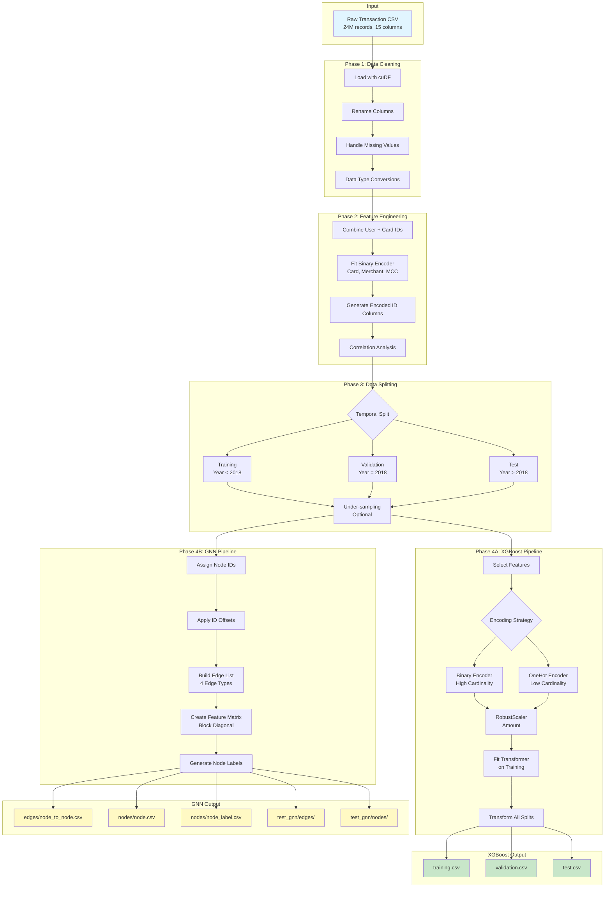
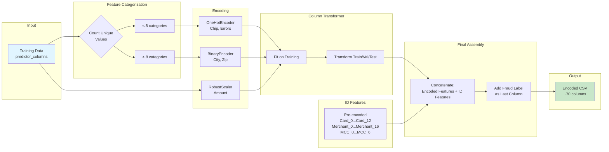
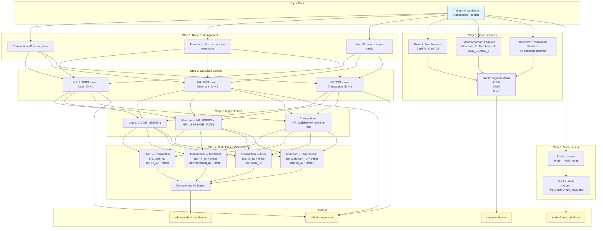
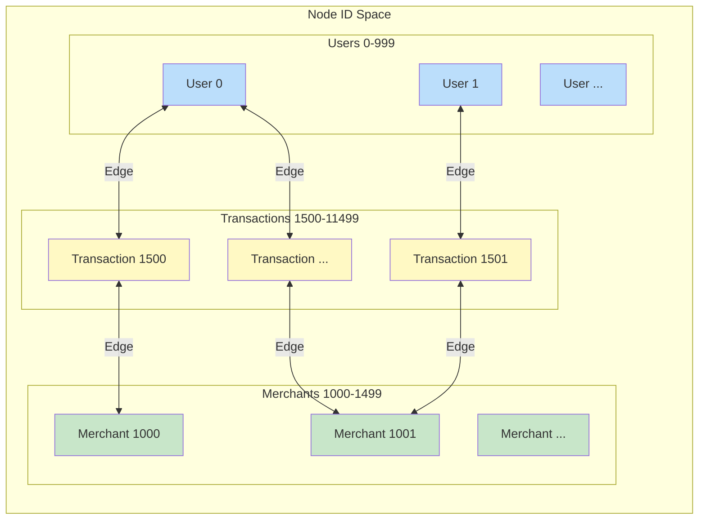
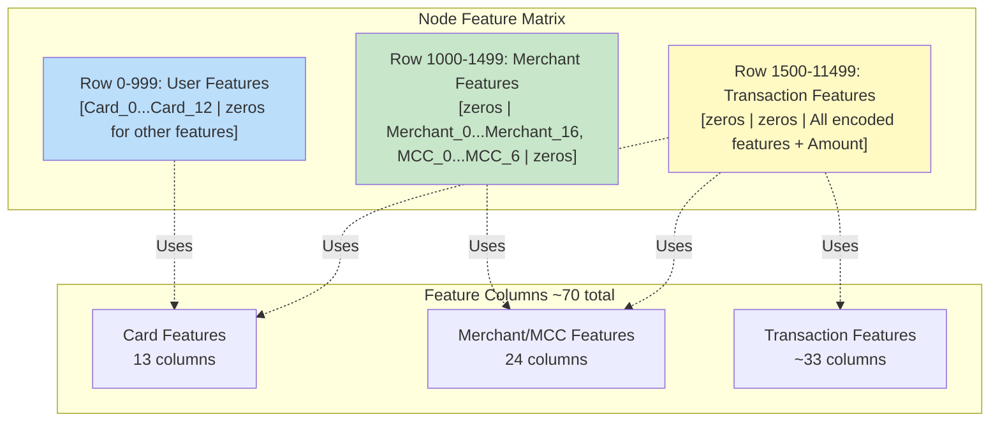
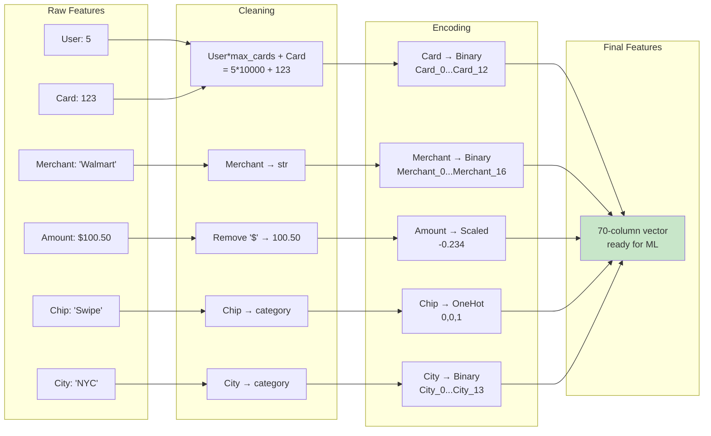
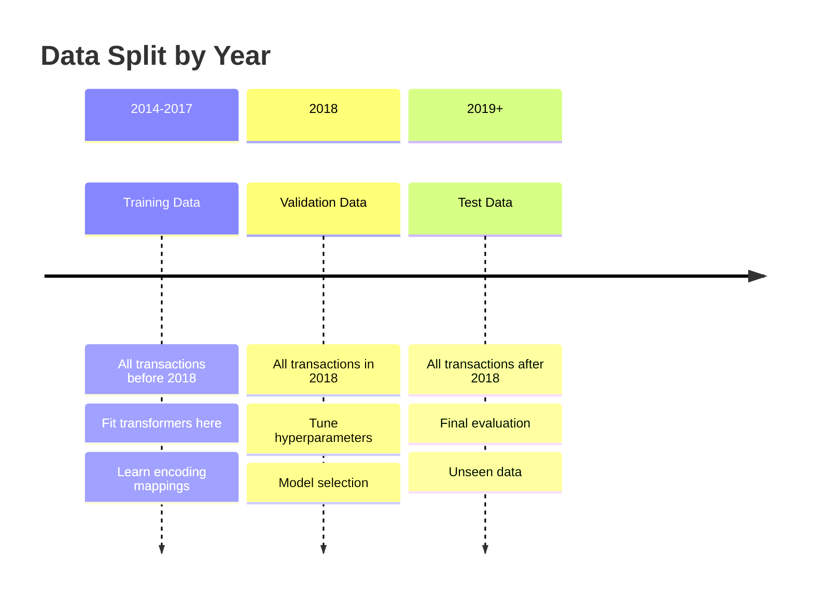
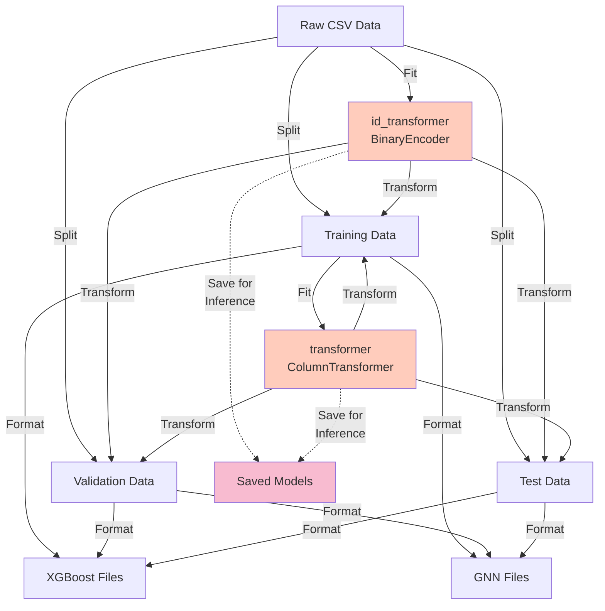

# TabFormer Data Processing Architecture

## 1. High-Level System Architecture

## 2. Detailed XGBoost Pipeline

## 3. Detailed GNN Pipeline - Graph Construction

## 4. Graph Structure Visualization

## 5. Feature Matrix Structure (Block Diagonal)

## 6. Data Transformation Flow

## 7. Temporal Data Split Strategy

## 8. Component Dependencies

## Key Insights for Architecture

### XGBoost Path
- **Input**: Tabular transaction records
- **Output**: Flat CSV with ~70 encoded columns
- **Key**: Maintains row-level independence

### GNN Path
- **Input**: Same tabular records
- **Output**: Graph structure (nodes + edges + features)
- **Key**: Creates relationships between entities

### Shared Components
- Both paths use the same fitted transformers
- Ensures consistency between XGBoost and GNN features
- Critical for ensemble or comparison

### Inference Requirements
- Must save `id_transformer` and `transformer`
- New data must go through identical preprocessing
- Same encoding mappings must be applied
