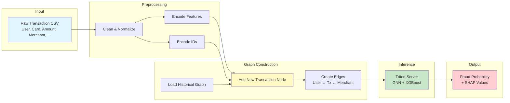
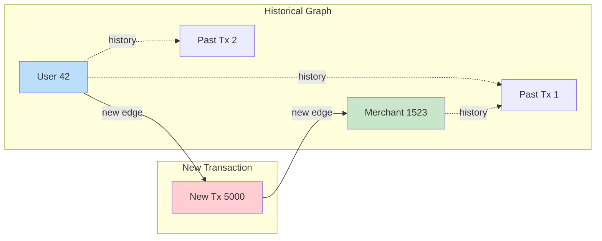

# Single Transaction Inference Guide

## Overview

This guide explains how to perform fraud detection inference on individual transactions using the GNN+XGBoost hybrid model deployed on Triton Inference Server.

## Challenge: From Raw CSV to Graph

The model requires graph structure (nodes and edges), but you have a single transaction row. Here's how we solve it:



## Architecture

### 1. Historical Graph Context

The model needs historical context to make predictions. We maintain:

```
Historical Graph:
├── User Nodes (0 to NR_USERS-1)
├── Merchant Nodes (NR_USERS to NR_USERS+NR_MXS-1)
├── Historical Transaction Nodes
└── Edges connecting them
```

### 2. Adding New Transaction

When a new transaction arrives:



The new transaction becomes node 5000, connected to:
- User 42 (existing user node)
- Merchant 1523 (existing merchant node)

### 3. GNN Aggregation

The GNN then aggregates information:

```
New Transaction Node 5000:
├── Direct features: Amount, Time, Chip, etc.
├── User 42 context: Spending history, past fraud
├── Merchant 1523 context: Fraud rate, reputation
└── Network context: Similar transactions, patterns
```

## Step-by-Step Process

### Step 1: Preprocess Raw Transaction

```python
raw_transaction = {
    'User': 42,
    'Card': 5,
    'Amount': '$500.00',
    'Merchant Name': 'ShopX',
    # ... other fields
}

# Clean and normalize
cleaned = {
    'Amount': 500.0,  # Remove $
    'Time': 870,      # Convert "14:30" to minutes
    'Card': 420005,   # Combine User*10000 + Card
    # ...
}

# Encode features
encoded_features = transformer.transform(cleaned)
# Result: [0, 1, 0, 1, ..., 0.234] (70 dims)

encoded_ids = id_transformer.transform(cleaned)
# Result: [1, 0, 1, 0, ..., 1] (Card/Merchant/MCC binary encoded)

# Combine
final_features = [encoded_features | encoded_ids]
# Result: 70 + encoded_id_dims = ~198 dims
```

### Step 2: Build Inference Graph

```python
# Load historical graph
historical_nodes = load("gnn/nodes/node.csv")  # Shape: (N, 70)
historical_edges = load("gnn/edges/node_to_node.csv")  # Shape: (2, E)

# Add new transaction node
new_node_id = historical_nodes.shape[0]  # e.g., 5000
all_nodes = vstack([historical_nodes, final_features])  # Shape: (N+1, 70)

# Create edges for new transaction
new_edges = [
    [user_id, new_node_id],           # User -> Transaction
    [new_node_id, user_id],           # Transaction -> User
    [new_node_id, merchant_id],       # Transaction -> Merchant
    [merchant_id, new_node_id]        # Merchant -> Transaction
]

# Combine edges
all_edges = hstack([historical_edges, new_edges])  # Shape: (2, E+4)
```

### Step 3: Call Triton Server

```python
# Prepare inputs
node_features = all_nodes.astype(np.float32)
edge_index = all_edges.astype(np.int64)

# Create Triton inputs
input_features = httpclient.InferInput("NODE_FEATURES", node_features.shape, "FP32")
input_features.set_data_from_numpy(node_features)

input_edges = httpclient.InferInput("EDGE_INDEX", edge_index.shape, "INT64")
input_edges.set_data_from_numpy(edge_index)

# Call server
response = client.infer(
    "prediction_and_shapley",
    inputs=[input_features, input_edges, ...]
)

# Extract prediction for new transaction (last node)
predictions = response.as_numpy('PREDICTION')
fraud_prob = predictions[-1, 0]  # Last node is our new transaction
```

### Step 4: Interpret Results

```python
if fraud_prob > 0.5:
    print(f"FRAUD ALERT! Probability: {fraud_prob:.2%}")
else:
    print(f"Legitimate. Probability: {fraud_prob:.2%}")
```

## Key Differences: Batch vs Single

### Batch Inference (Your Current Code)

```python
# Input: Pre-built graph with many transactions
X = load("test_nodes.csv")        # Shape: (10000, 70)
edge_idx = load("test_edges.csv") # Shape: (2, 50000)

# All transactions already in graph
predictions = triton_infer(X, edge_idx)  # Shape: (10000, 1)

# Evaluate all at once
accuracy = accuracy_score(y_true, predictions > 0.5)
```

### Single Transaction Inference (New Approach)

```python
# Input: One raw transaction
raw_tx = {'User': 42, 'Amount': '$500', ...}

# Build graph on-the-fly
X_historical = load("historical_nodes.csv")
edges_historical = load("historical_edges.csv")

# Add new transaction
X_new = preprocess(raw_tx)
X_combined = vstack([X_historical, X_new])

# Add edges for new transaction
edges_new = create_edges(user_id, merchant_id, new_tx_id)
edges_combined = hstack([edges_historical, edges_new])

# Infer
prediction = triton_infer(X_combined, edges_combined)[-1]  # Last node only
```

## Implementation Options

### Option 1: Use Provided Class (Recommended)

```python
from single_transaction_inference import SingleTransactionInference

client = SingleTransactionInference(
    transformer_path="transformers/transformer.pkl",
    id_transformer_path="transformers/id_transformer.pkl",
    historical_graph_path="gnn/",
    host="localhost",
    http_port=8000
)

result = client.predict_single_transaction(raw_transaction)
print(f"Fraud Probability: {result['fraud_probability']}")
```

### Option 2: Modify Batch Function

```python
def compute_score_for_single(raw_transaction, transformers, historical_graph):
    # 1. Preprocess
    features = preprocess_transaction(raw_transaction, transformers)
    
    # 2. Build graph
    node_features, edge_index = build_inference_graph(
        features,
        historical_graph
    )
    
    # 3. Call Triton (same as batch)
    with httpclient.InferenceServerClient(f"{HOST}:{HTTP_PORT}") as client:
        # ... same input preparation ...
        response = client.infer(model_name, inputs=[...])
    
    # 4. Extract last node prediction
    predictions = response.as_numpy('PREDICTION')
    return predictions[-1, 0]  # Last node is the new transaction
```

## Required Artifacts

To perform single transaction inference, you need:

1. **Fitted Transformers** (from training):
   ```
   transformers/
   ├── transformer.pkl          # ColumnTransformer for features
   └── id_transformer.pkl       # BinaryEncoder for Card/Merchant/MCC
   ```

2. **Historical Graph** (from training/validation):
   ```
   gnn/
   ├── edges/
   │   └── node_to_node.csv     # Historical edges
   ├── nodes/
   │   ├── node.csv             # Historical node features
   │   └── offset_range_of_training_node.json
   ```

3. **Triton Server** (running):
   ```
   python_backend_model_repository/
   └── prediction_and_shapley/
       ├── 1/
       │   ├── model.py
       │   ├── state_dict_gnn_model.pth
       │   └── embedding_based_xgboost.json
       └── config.pbtxt
   ```

## Saving Transformers During Training

Add this to your training script:

```python
import pickle

# After fitting transformers
with open('transformers/transformer.pkl', 'wb') as f:
    pickle.dump(transformer, f)

with open('transformers/id_transformer.pkl', 'wb') as f:
    pickle.dump(id_transformer, f)
```

## Performance Considerations

### Latency

Single transaction inference is slower than batch because:
- Graph construction overhead
- Smaller batch size (GPU underutilized)
- Network round-trip to Triton

**Typical latency**: 50-200ms per transaction

### Optimization Strategies

1. **Keep historical graph in memory**:
   ```python
   # Load once at startup
   client = SingleTransactionInference(...)
   
   # Reuse for many predictions
   for tx in transactions:
       result = client.predict_single_transaction(tx)
   ```

2. **Micro-batching**:
   ```python
   # Accumulate transactions
   batch = []
   for tx in stream:
       batch.append(tx)
       if len(batch) >= 10:
           results = client.predict_batch(batch)
           batch = []
   ```

3. **Cache user/merchant features**:
   ```python
   # Cache frequently accessed nodes
   user_cache = {}
   merchant_cache = {}
   ```

## Example: Real-Time API

```python
from flask import Flask, request, jsonify

app = Flask(__name__)
client = SingleTransactionInference(...)

@app.route('/predict', methods=['POST'])
def predict():
    raw_transaction = request.json
    
    result = client.predict_single_transaction(raw_transaction)
    
    return jsonify({
        'fraud_probability': float(result['fraud_probability']),
        'is_fraud': bool(result['is_fraud']),
        'threshold': result['decision_threshold']
    })

if __name__ == '__main__':
    app.run(host='0.0.0.0', port=5000)
```

## Troubleshooting

### Issue: "Transformer not found"

**Solution**: Save transformers during training:
```python
pickle.dump(transformer, open('transformer.pkl', 'wb'))
```

### Issue: "Node ID mismatch"

**Solution**: Ensure user/merchant IDs are mapped correctly:
```python
# Use same mapping as training
user_id = user_to_id_mapping.get(user, 0)
merchant_id = merchant_to_id_mapping.get(merchant, 0)
```

### Issue: "Feature dimension mismatch"

**Solution**: Ensure preprocessing matches training exactly:
- Same encoding strategy (binary vs one-hot)
- Same feature order
- Same missing value handling

## Summary

**Key Steps**:
1. Load fitted transformers and historical graph
2. Preprocess raw transaction (clean, encode)
3. Add transaction as new node to historical graph
4. Create edges connecting to user and merchant
5. Call Triton with combined graph
6. Extract prediction for the new node (last node)

**Key Insight**: The GNN model needs graph context, so we maintain a historical graph and dynamically add new transactions as nodes with appropriate edges.
